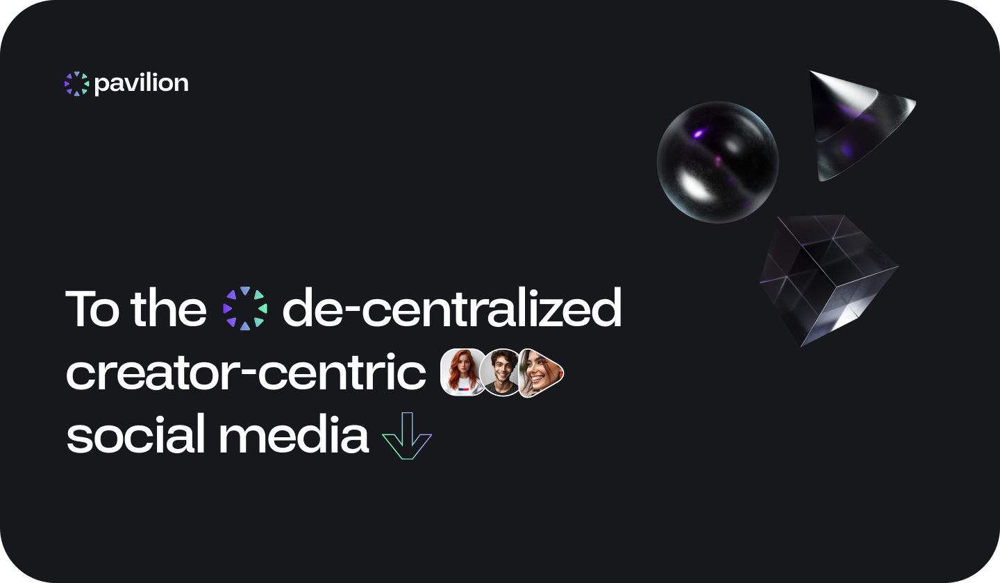

# 🚨 IMPORTANT ANNOUNCEMENT 🚨

## Purpie has been rebranded to Pavilion!

We're excited to announce that Purpie has been rebranded to Pavilion. The project has moved to a new repository:

**👉 [https://github.com/consensuslabs/pavilion-network](https://github.com/consensuslabs/pavilion-network) 👈**

Please visit the new repository for the latest updates, documentation, and to contribute to the project.

This repository will remain available for historical purposes, but all new development will happen in the new repository.

## What is Purpie?

Purpie is an open-source platform that brings together many different solutions, to create a space focused on video-oriented communication and content sharing. The project has been rebranded to Pavilion and moved to a new repository.

## Roadmap

You can find our short term and long term goals for the project in the [Roadmap](https://docs.pavilion.network/en/latest/08.road_map.html) on our new documentation site.

## Setup

For setup instructions, please visit the new repository at [https://github.com/consensuslabs/pavilion-network](https://github.com/consensuslabs/pavilion-network).

## Tech Stack
### Frontend Features

- Typescript (Strict Mode)
- ESNext
- React
- Prettier
- Airbnb Coding Style Guide
- Hooks
- React Router
- Redux
- Styled Components
- Grommet
- No transpilers, just vanilla javascript
- ES2017 latest features like Async/Await

### Backend Features

- [Typescript](https://www.typescriptlang.org/) (Strict Mode)
- [Airbnb Coding Style Guide](https://github.com/airbnb/javascript)
- ESNext
- CORS enabled
- [yarn](https://yarnpkg.com) for package management
- [Handlebars](https://handlebarsjs.com/) for rendering email templates
- [NestJS](https://nestjs.com/) is the main framework
- [Postgresql](https://www.postgresql.org/) is the database used
- [TypeORM](https://typeorm.io) is the database ORM used
- [Class Validator](https://github.com/typestack/class-validator) is used to validate request body.
- [helmet](https://github.com/helmetjs/helmet) is used to set http headers correctly.
- [dotenv](https://github.com/rolodato/dotenv-safe) is used to load .env variables
- [compression](https://github.com/expressjs/compression)
- [eslint](http://eslint.org)
- [morgan](https://github.com/expressjs/morgan)
- [Swagger](https://swagger.io/)
- Monitoring with [pm2](https://github.com/Unitech/pm2)

## Developer Guide

You can find the developer guide in [Developer Guide](https://docs.pavilion.network/en/latest/09.developer_guide.html)

## Contributing Guideline

We are open to, and grateful for, any contributions made by the community. Please visit our new repository at [https://github.com/consensuslabs/pavilion-network](https://github.com/consensuslabs/pavilion-network) to contribute.

## Questions and Support

You can visit [Pavilion Docs](https://docs.pavilion.network/en/latest) to learn how the project works. If you have any questions, you can ask them in [Pavilion Community](https://community.pavilion.network).

## License

Purpie is open-source and is released under the [Apache License 2.0](https://github.com/doganbros/purpie/blob/develop/LICENSE).
